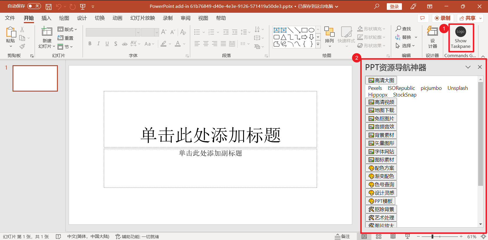
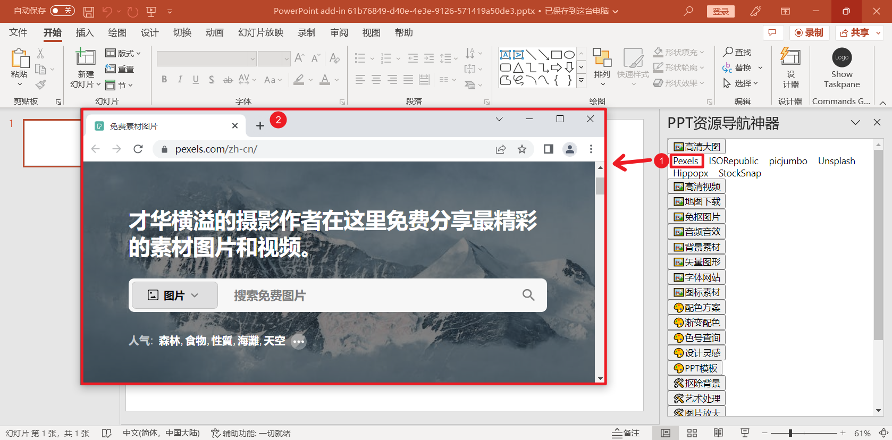

# ppt-nav-tools-add-ins


PPT资源导航神器，参考了幻云神器导航2.0。

幻云神器导航2.0插件的缺点：

1. 切换太卡太慢了，耗时10秒左右，等得人想吐血。
2. 链接仍是跳转到外部浏览器，无法整合到PPT侧边窗口。

因此，转而使用sideload。

## 开发

### 开发环境
npm使用16.x，受office sideload的限制，最高版本为nodejs18和npm9

```
npm config get registry # 查看当前源
npm config set registry https://registry.npmmirror.com # npm换国内源
npm install -g yo generator-office # 安装Office 加载项的 Yeoman 生成器，要求nodejs18 npm9
npx office-addin-dev-certs install # 必须安装证书
```

### 调试

解压本仓库，vscode进入文件夹，再调出vscode的terminal

```shell
npm install
npm start
```

### 



### 编译

TypeScript 代码编译成 JavaScript

```shell
npm run build
```

### 打包并发布
将生成的 index.html 和 dist 文件夹打包成一个 ZIP 文件，然后将该 ZIP 文件作为 PowerPoint [sideload add-in插件上传](https://learn.microsoft.com/zh-cn/office/dev/add-ins/testing/sideload-office-add-ins-for-testing) 并安装即可。

## Todo

- [ ] 链接不跳转到外部浏览器，而是使用Dialogs实现popup弹窗。参考：[TrainingContent/OfficeAddin/02 Building Add-ins for Microsoft Excel/Demos/03 Dialogs](https://github.com/OfficeDev/TrainingContent/tree/master/OfficeAddin/02%20Building%20Add-ins%20for%20Microsoft%20Excel/Demos/03%20Dialogs)
- [ ] 上传到office 365 store